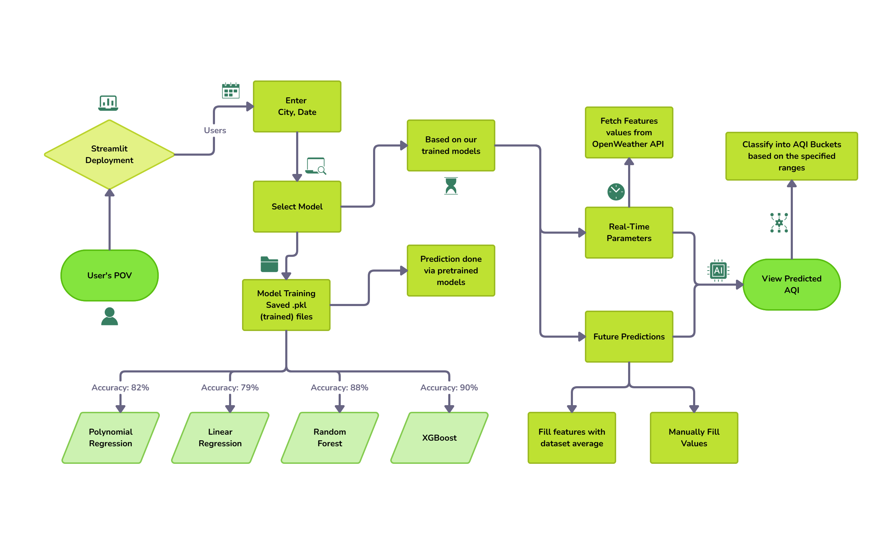

# AQI Prediction Dashboard

## Overview
The **AQI Prediction Dashboard** is a Streamlit-based web application designed to predict the Air Quality Index (AQI) for various cities in India using machine learning models. The app integrates real-time air pollution data from the OpenWeather API and leverages pre-trained models (Random Forest, XGBoost, Polynomial Regression, and Linear Regression) to provide accurate AQI predictions. The project is built with Python and includes data preprocessing, model training, and an interactive user interface.

### Features
- Predict AQI for cities like Delhi, Bengaluru, Hyderabad, Chennai, Lucknow, Mumbai, Patna, Gurugram, Jaipur, and Ahmedabad.
- Fetch real-time air quality data using the OpenWeather API.
- Use pre-trained machine learning models for AQI prediction.
- Options to manually enter pollutant levels or autofill with mean values.

## Installation and Setup

### Step 1: Clone the Repository
1. Clone the repository to your local machine:
   ```bash
   git clone https://github.com/your-username/AQI_FINAL.git
   cd aqi_final
   ```
### Step 2: Set Up the Virtual Environment
1. Create a virtual environment (optional but recommended):
   ```bash
   python -m venv venv
   ```
2. Activate the virtual environment:
   On Windows:
   ```bash
   venv\Scripts\activate
   ```
   On macOS/Linux:
   ```bash
   source venv/bin/activate
   ```
### Step 3: Install Dependencies
1. Install the required Python packages listed in requirements.txt:
   ```bash
   pip install -r requirements.txt
   ```
### Step 4: Configure Environment Variables
1. Create a .env file in the train/ directory.
2. Add your OpenWeather API key to the .env file:
   ```bash
   API_KEY=your_openweather_api_key_here
   ```
### Step 5: Verify Data Files
1. Ensure the following files are present:
   1. train/training_dataset.csv: Contains the training data used to calculate mean pollutant levels.
   2. train/trained_models/: Contains the pre-trained model files (linear_regression_model.pkl, polynomial_regression_model.pkl, random_forest_model.pkl, xgboost_model.pkl).  
2. If any file is missing, copy it from the data_clean/ directory (e.g., dataset-final.csv can be used as training_dataset.csv after cleaning) or regenerate it using training_final.ipynb.


### Running the Project

### Step 1: Navigate to the Train Directory
1. Change to the train directory:
   ```bash
   cd train
   ```
### Step 2: Run the Streamlit App
1. Start the Streamlit application:
   ```bash
   streamlit run app.py
   ```
2. Open your web browser and go to the URL provided by Streamlit.


### Deployment
The app is deployed on Streamlit Community Cloud.



